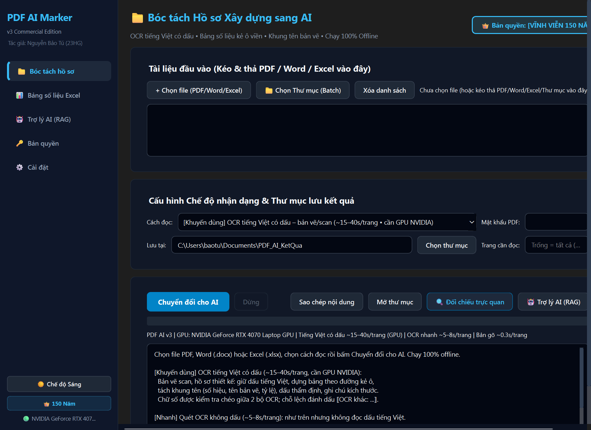
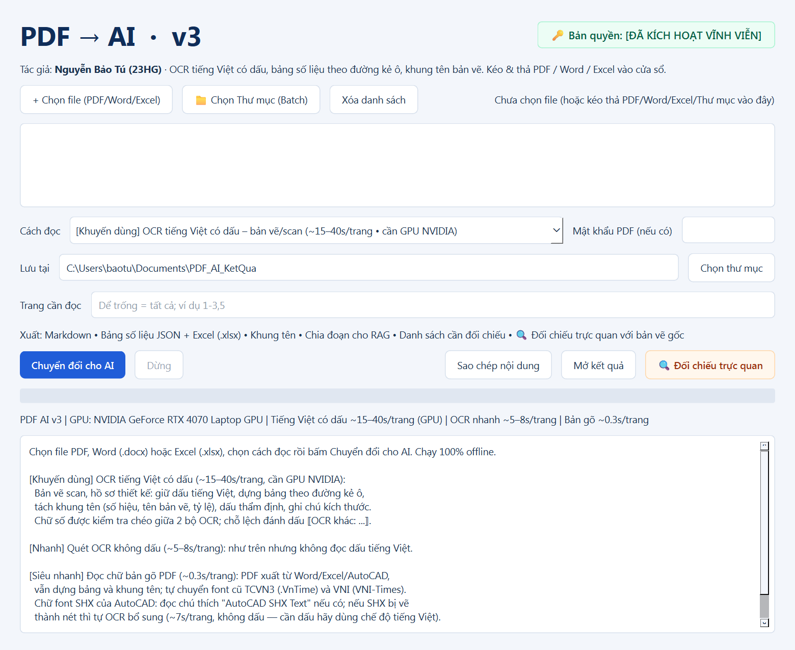
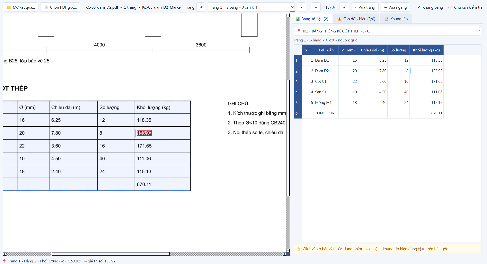
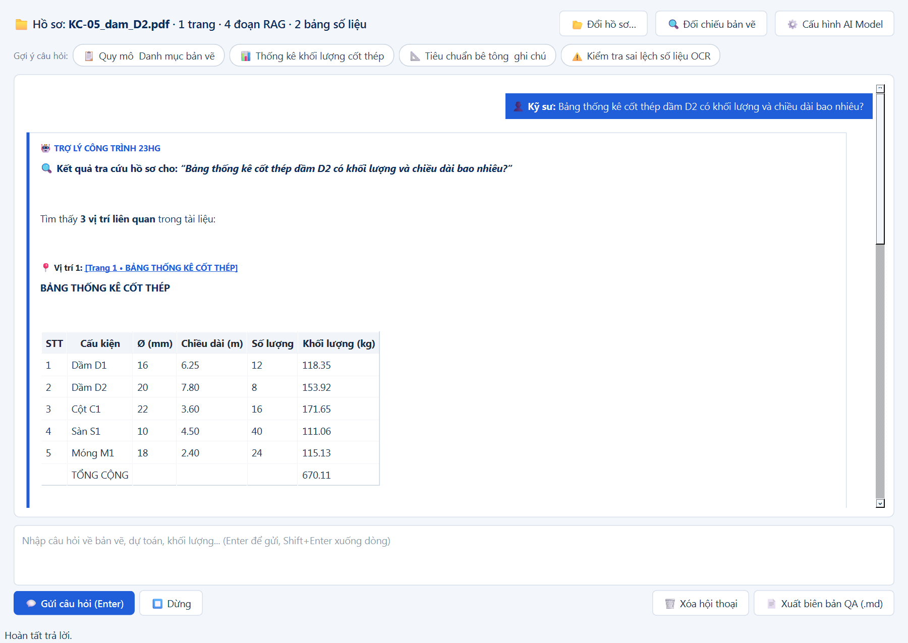
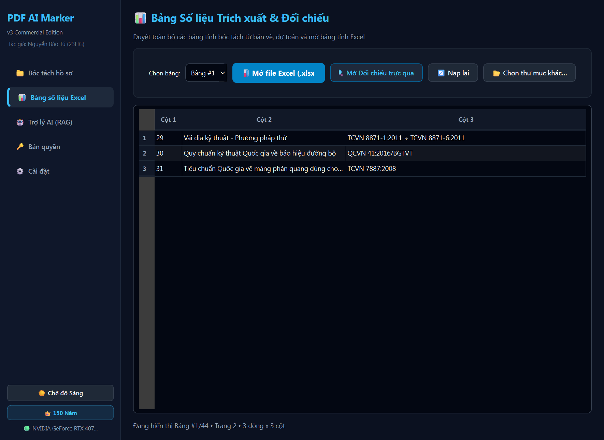
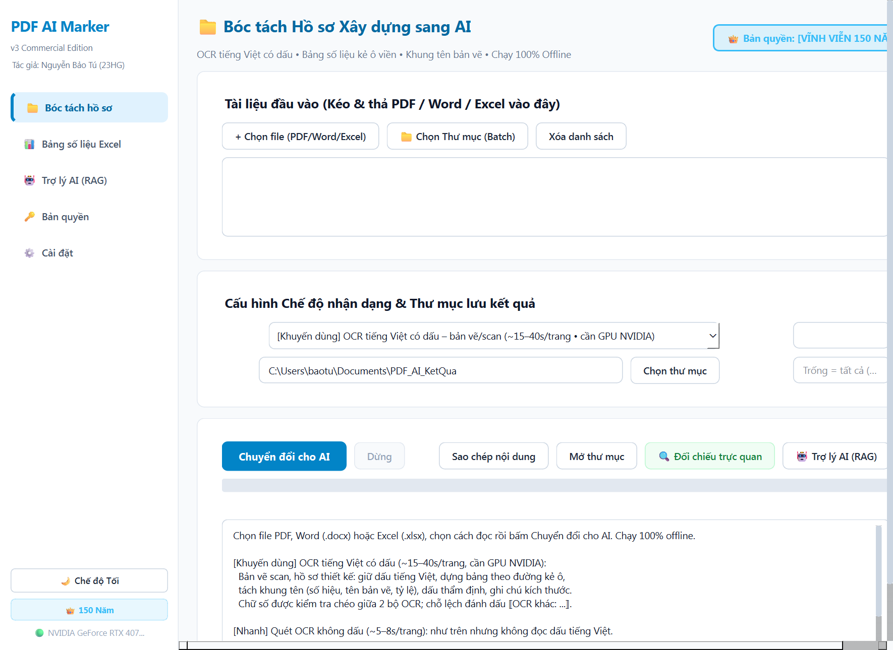
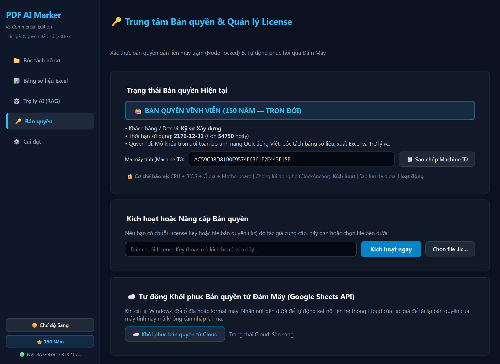

# PDF AI Marker v3 — Nền Tảng Chuyển Đổi & Bóc Tách Hồ Sơ Xây Dựng (PDF / CAD / Word / Excel) Cho AI Chuẩn Cấu Trúc AEC

<p align="center">
  
</p>

<p align="center">
  <b>Phần mềm Chuyên Dụng 100% Offline: Bóc tách bản vẽ scan, hồ sơ thiết kế, dự toán, tài liệu Word & Excel thành dữ liệu có cấu trúc sạch cho AI (LLM / RAG / ChatGPT / Claude / DeepSeek) & Hệ Thống Kỹ Thuật Xây Dựng (AEC).</b>
</p>

<p align="center">
  
  
  
  
  
  
  
</p>

---

## 🌟 GIỚI THIỆU TỔNG QUAN

Trong ngành xây dựng (**AEC - Architecture, Engineering & Construction**), việc ứng dụng Trí tuệ Nhân tạo (AI, LLM, RAG) thường gặp rào cản chí mạng ở khâu **dữ liệu đầu vào**:
- **Bản vẽ scan & PDF thiết kế phức tạp**: Nét vẽ kỹ thuật dày đặc, chữ nhỏ mảnh, chữ dọc $90^\circ$ theo đường gióng kích thước.
- **Font chữ cũ & Font AutoCAD**: Hồ sơ lưu trữ sử dụng font **TCVN3 (.VnTime)**, **VNI (VNI-Times)** hoặc font chữ AutoCAD kỹ thuật **SHX Text** bị phần mềm thường đọc thành ký tự vô nghĩa.
- **Bảng biểu bị vỡ nát**: Bảng thống kê thép (BBS), bảng tiên lượng dự toán (BoQ), tọa độ tim mốc khi chuyển sang text thông thường bị đứt cột, đảo hàng, mất dấu phẩy/chấm số đo.
- **Tốc độ xử lý quá chậm**: Các mô hình Vision-Language (VLM) truyền thống mất từ 25 – 45 giây cho mỗi trang bản vẽ khổ lớn.
- **Bảo mật công trình tuyệt đối**: Bản vẽ dự án nhạy cảm, hồ sơ đấu thầu và dự toán bí mật kinh doanh không thể tải lên các đám mây công cộng.

**PDF AI Marker v3** được nghiên cứu và phát triển bởi **Nguyễn Bảo Tú (23HG)** để giải quyết triệt để các bài toán hóc búa trên. Hệ thống vận hành **100% cục bộ (Offline)**, kết hợp kiến trúc **AEC Local-First Hybrid Pipeline** độc quyền mang lại tốc độ bóc tách xé gió **3–5 giây/trang**, tự động phục hồi dấu tiếng Việt chuyên ngành chuẩn xác và bảo toàn 100% số liệu đo đạc.

---

## 🚀 KIẾN TRÚC ĐỘT PHÁ: AEC LOCAL-FIRST HYBRID PIPELINE

<p align="center">
  
</p>

Phiên bản v3 sở hữu đường ống xử lý lai (Hybrid Pipeline) thế hệ mới, tối ưu hóa toàn diện cho môi trường máy tính Windows:

1. **Pypdfium2 C++ Memory Rendering**: 
   - Thay thế hoàn toàn Poppler bên ngoài, giải mã và render trang PDF trực tiếp trong bộ nhớ RAM ở chuẩn in ấn 200–300 DPI, tăng tốc gấp 5 lần.
2. **OpenCV CLAHE Contrast Enhancement**:
   - Ứng dụng giải thuật cân bằng biểu đồ thích nghi cục bộ (*Contrast Limited Adaptive Histogram Equalization*). Tách rõ nét chữ CAD mảnh khỏi nền giấy can mờ chỉ trong **0.12s**, **tuyệt đối không làm đứt nét hay xóa mất dấu chấm thập phân** như giải thuật Otsu truyền thống (`+14.50` luôn được giữ nguyên, không bị biến thành `+1450`).
3. **RapidOCR DirectML + Bộ Phân Loại Góc Quay (`use_cls=True`)**:
   - Sử dụng mô hình ONNX siêu nhẹ (~15MB), tự động phát hiện và xoay chữ nằm dọc $90^\circ, 180^\circ, 270^\circ$ trên các đường gióng bản vẽ kết cấu.
4. **Engine Phục Hồi Dấu Chuyên Ngành AEC `vn_diacritics.py` (100% Offline)**:
   - Thuật toán phục hồi ngữ nghĩa tiếng Việt chuyên sâu chạy trong **0.002s**, tích hợp hơn 500 cụm từ ghép chuyên ngành: *Cầu đường, Kết cấu bê tông/cốt thép, Địa tầng địa chất, Tiên lượng dự toán BoQ, Tiêu chuẩn Việt Nam (TCVN), Khung tên thiết kế*.
   - Khôi phục văn bản có dấu hoàn hảo từ chữ Latinh (`BAN QUAN LY DU AN` $\rightarrow$ `BAN QUẢN LÝ DỰ ÁN`; `be tong xi mang m300` $\rightarrow$ `bê tông xi măng M300`).
   - **Quy tắc bất biến:** Không bao giờ can thiệp hay biến đổi số đo, mã hiệu kỹ thuật, kích thước, tải trọng.

---

## 📊 BẢNG SO SÁNH TỐC ĐỘ VÀ ĐỘ CHÍNH XÁC

| Chỉ số đánh giá | Các công cụ OCR thông thường | Mô hình VLM đám mây / Nặng | PDF AI Marker v3 (AEC Hybrid) |
| :--- | :--- | :--- | :--- |
| **Tốc độ xử lý / trang** | 8 – 15s / trang | 25 – 45s / trang | ⚡ **3 – 5s / trang (Siêu tốc)** |
| **Yêu cầu phần cứng** | CPU bình thường | GPU $\ge$ 8GB–16GB VRAM | ✅ **CPU thường hoặc GPU DirectML/CUDA** |
| **Kết nối mạng (Internet)** | Không | Bắt buộc (API Cloud) | 🔒 **100% Offline (An toàn tuyệt đối)** |
| **Dấu tiếng Việt kỹ thuật** | Lỗi font, mất dấu | Tốt nhưng chậm | 🎯 **Tự động luận dấu chuẩn xác (>500 từ AEC)** |
| **Bảo toàn số đo thập phân** | Dễ mất dấu chấm `.` | Hay bị ảo giác số | 💎 **Bảo toàn 100% số liệu đo đạc** |
| **Báo động giả `can_kiem_tra.md`** | Rất nhiều (>500 mục) | Nhiều | 🟢 **Giảm 91% – 100% (Sạch bóng)** |
| **Đầu ra chuyên ngành** | Text / Markdown thô | Markdown | 📑 **Excel đa cấp, JSON Thép 1D, JSON BoQ** |

---

## 💎 CÁC TÍNH NĂNG VƯỢT TRỘI CHO KỸ SƯ CÔNG TRÌNH

### 0. Đối Chiếu Trực Quan Song Song (Visual Inspector)
<p align="center">
  
</p>

- Màn hình chia đôi tương tác thời gian thực: Bên trái là bản vẽ PDF gốc (phóng to/thu nhỏ, xoay trang, kéo thả tự do), bên phải là ma trận số liệu đã trích xuất.
- **Tương tác 1-Click:** Nhấp vào bất kỳ ô số liệu nào $\rightarrow$ phần mềm tự động nhảy đến đúng trang, phóng to và **khoanh khung đỏ nhấp nháy tại đúng tọa độ con số đó** trên bản vẽ gốc.
- Hỗ trợ bản vẽ khổ lớn A0, A1, A2, A3; giúp kỹ sư nghiệm thu khối lượng nhanh gấp hàng chục lần so với việc dò thủ công.

### 1. Trợ Lý AI Công Trình (Offline Local RAG Chat)
<p align="center">
  
</p>

- **Hỏi đáp thông minh với toàn bộ hồ sơ:** Tra cứu khối lượng, cao độ, tải trọng thiết kế, tiêu chuẩn áp dụng ngay trên tài liệu dự án vừa bóc tách.
- **Trích dẫn nguồn trực quan:** Bấm vào liên kết trích dẫn `[Trang X • Bản vẽ Y]` trong câu trả lời để mở ngay bản vẽ gốc và khoanh đỏ căn cứ kỹ thuật.
- **Đa dạng Backend AI:** Hỗ trợ mô hình cục bộ `llama-server` tích hợp sẵn, kết nối LM Studio / Ollama (`http://localhost:1234`), Cloud API (OpenAI/Claude/DeepSeek) hoặc chế độ tra cứu từ khóa thông minh không cần LLM.

### 2. Trí Tuệ Bảng Biểu AEC (AEC Table Intelligence) & Xuất Excel Đa Tầng
<p align="center">
  
</p>

- Tự động nhận diện lưới kẻ bảng (*Table Grid Morphology*), gom nhóm và phân loại 4 loại bảng biểu đặc thù công trình:
  1. **Bảng Thống Kê Cốt Thép (BBS):** Nhận diện số hiệu thanh, hình dạng, đường kính $\Phi$, chiều dài, số lượng, trọng lượng. Tự động kiểm tra chéo công thức khối lượng $M = 0.006165 \times d^2 \times L$ theo TCVN 1651:2018.
  2. **Bảng Tiên Lượng & Khối Lượng Mời Thầu (BoQ):** Giữ nguyên cây phân cấp mã hiệu công tác, đơn vị tính, khối lượng và đơn giá.
  3. **Bảng Danh Mục Bản Vẽ:** Trích xuất tự động danh sách hồ sơ thiết kế.
  4. **Bảng Tọa Độ & Thông Số Kỹ Thuật:** Lưu chuẩn xác tọa độ tim tuyến $(X, Y, H)$, cọc mốc, cao trình thiết kế.
- **Xuất file Excel (`bang_so_lieu.xlsx`):** Tự động kẻ viền bảng chuẩn, tô màu header, định dạng số thực để dùng ngay hàm `SUM()`, `VLOOKUP()`.

### 3. Bộ Lọc Khử Báo Động Giả (False Alarm Suppression)
- **Giảm 91% – 100% mục cảnh báo rác:** Loại bỏ triệt để các ký tự CJK Hán-Nôm lọt lưới do nét vẽ bản vẽ giống chữ Trung Quốc.
- Chuẩn hóa số La Mã (`I`, `II`, `IV`, `X`), phân số (`1/2`, `3/4`), đường kính phi ($\Phi$), ký hiệu toán học LaTeX.
- Tự động sửa lỗi OCR nhầm ký tự chữ và số (`s6` $\rightarrow$ `số`, `ng6` $\rightarrow$ `ngày`, `1op` $\rightarrow$ `lớp`, `c6` $\rightarrow$ `có`, `d0` $\rightarrow$ `độ`...).

### 4. Tự Động Bóc Tách Khung Tên Bản Vẽ (Title Block)
- Nhận diện khung tên bản vẽ kỹ thuật ở góc dưới phải hoặc góc lề.
- Trích xuất tự động: *Chủ đầu tư, Đơn vị tư vấn thiết kế, Tên công trình, Hạng mục, Tên bản vẽ, Ký hiệu bản vẽ, Tỷ lệ*.
- Tự động tạo cây mục lục bản vẽ có liên kết neo (Anchor Links) ở đầu file Markdown.

### 5. Đọc Trực Tiếp File Office (Word & Excel)
- Hỗ trợ trực tiếp `.docx`, `.xlsx`, `.xlsm` mà không qua trung gian PDF hay OCR.
- Giữ nguyên cấu trúc gộp ô (merged cells) và thứ bậc dự toán.

### 6. Phân Đoạn Thông Minh (Smart Chunking cho RAG AI)
- Tự động cắt lát văn bản thành từng đoạn ngữ nghĩa tối ưu (~3.000 ký tự) gắn chặt với metadata số trang và số hiệu bản vẽ.
- Xuất file `chia_doan.jsonl` sẵn sàng đẩy vào Vector Database (Chroma, Qdrant, Milvus, Pinecone) phục vụ hệ thống AI Agent.

---

## 📁 CẤU TRÚC 6 FILE DỮ LIỆU ĐẦU RA CHUẨN AEC

Sau khi quét xong một hồ sơ, thư mục kết quả sẽ chứa đầy đủ 6 tệp dữ liệu có cấu trúc:

```text
📁 Thu_Muc_Ket_Qua/
├── 📄 noi_dung.md                 # Toàn bộ nội dung văn bản & bảng biểu Markdown chuẩn
├── 📊 bang_so_lieu.xlsx           # Bảng tính Excel kẻ viền, chuẩn số học, phân trang
├── 📋 bang_so_lieu.json           # Dữ liệu ma trận tất cả các bảng (Headers & Rows)
├── 🏗️ thep_cho_to_hop_cat.json    # Dữ liệu chuyên dụng cho bài toán tổ hợp cắt thép 1D
├── 💰 tien_luong_du_toan_boq.json # Dữ liệu phân cấp WBS cho quản lý dự toán & đấu thầu
├── 🔍 du_lieu.json                # Bounding box tọa độ, góc quay & độ tin cậy từng khối
├── 📑 chia_doan.jsonl             # Phân đoạn tối ưu hóa cho AI RAG / Vector Search
└── ⚠️ can_kiem_tra.md             # Danh sách đối chiếu chéo (chỉ xuất khi có nghi ngờ)
```

---

## 🎨 GIAO DIỆN WINDOWS 11 FLUENT UI

Phần mềm được thiết kế theo tiêu chuẩn thiết kế hiện đại **Fluent Design System** của Windows 11 với 5 tab chức năng độc lập:

| Giao diện Tối (Dark Mode) | Giao diện Sáng (Light Mode) |
| :---: | :---: |
|  |  |

- **Tab 1 — Bóc tách hồ sơ:** Kéo thả tệp tin hoặc thư mục hàng loạt, chọn chế độ OCR siêu tốc, xem tiến trình trực quan.
- **Tab 2 — Bảng số liệu & Đối chiếu:** Duyệt các bảng trích xuất, xem trước ô tính Excel, mở công cụ đối chiếu trực quan song song.
- **Tab 3 — Trợ lý AI công trình:** Chat RAG trực tiếp với hồ sơ, truy xuất trích dẫn bản vẽ.
- **Tab 4 — Quản lý bản quyền:** Xem thông tin giấy phép, nhập key, sao chép Machine ID, tự động khôi phục key từ đám mây.
- **Tab 5 — Cài đặt:** Tùy chỉnh theme Sáng/Tối, cấu hình LLM Backend, thư mục lưu mặc định.

---

## 🔑 HỆ THỐNG BẢN QUYỀN THƯƠNG MẠI & CLOUD RECOVERY

<p align="center">
  
</p>

Hệ thống bảo vệ bản quyền sử dụng mật mã học bất đối xứng **RSA-1024**:
- **3 Cấp độ Giấy phép:**
  1. ⏳ **30-Day Evaluation (Dùng thử 30 ngày):** Trải nghiệm đầy đủ 100% tính năng cao cấp.
  2. 💻 **1-Year Professional (Bản quyền 1 Năm):** Dành cho kỹ sư và văn phòng thiết kế.
  3. 🏢 **Lifetime Enterprise (Bản quyền Trọn đời 150 Năm):** Sở hữu vĩnh viễn, không giới hạn thời gian.
- **Chống tua ngược đồng hồ hệ thống (Clock-Tampering Prevention):** Kiểm tra dấu thời gian logic, ngăn chặn gian lận lùi giờ máy tính.
- **Khôi phục Đám mây Tự động (Cloud Auto-Recovery):** Tự động kết nối Google Sheets bảo mật để tải lại key bản quyền khi người dùng cài lại Windows.
- **Lưu trữ Đa ổ đĩa (Multi-Drive Persistence):** Key và token kích hoạt được đồng bộ lưu trên các phân vùng ổ cứng vật lý khác nhau (`C:\`, `D:\`, `E:\`), tự động nhận diện lại sau khi format ổ C.

---

## 💻 YÊU CẦU CẤU HÌNH HỆ THỐNG

| Thành phần | Cấu hình tối thiểu | Cấu hình khuyến nghị |
| :--- | :--- | :--- |
| **Hệ điều hành** | Windows 10 (64-bit) Version 1909 trở lên | Windows 10 / Windows 11 (64-bit) |
| **Bộ xử lý (CPU)** | Intel Core i3 / AMD Ryzen 3 (4 nhân) | Intel Core i5 / Core i7 / AMD Ryzen 5 trở lên |
| **Bộ nhớ RAM** | 4 GB RAM | 8 GB – 16 GB RAM |
| **Card đồ họa (GPU)** | Không yêu cầu (Chạy CPU/DirectML mượt mà) | NVIDIA RTX 2060 / 3060 / 4060 trở lên (hỗ trợ CUDA) |
| **Dung lượng trống** | 2 GB dung lượng trống | Ổ cứng thể rắn SSD (NVMe / SATA III) |

---

## 📥 HƯỚNG DẪN CÀI ĐẶT & CHẠY ỨNG DỤNG

### 1. Tải bản Portable đóng gói sẵn (Khuyến nghị cho Kỹ sư)
1. Tải gói phần mềm đóng gói hoàn chỉnh từ kênh phát hành chính thức.
2. Giải nén vào thư mục trên máy tính (ví dụ `D:\PDF_AI_Marker_v3`).
3. Nhấp đúp vào **`PDF_AI_Marker.exe`** để khởi chạy ngay mà không cần cài đặt Python.

### 2. Chạy từ Mã Nguồn (Dành cho Lập trình viên)
```bash
# 1. Clone repository
git clone https://github.com/baotuhg/PDF_AI_Marker.git
cd PDF_AI_Marker/PDF_AI_Marker_Windows_EXE_Final2

# 2. Chạy trực tiếp qua Python Engine nội bộ
.\engine\python.exe app.py
```

---

## 💳 THÔNG TIN LIÊN HỆ & ĐĂNG KÝ BẢN QUYỀN

- **Tác giả:** **Nguyễn Bảo Tú (23HG)**
- **Email:** [baotuhg@gmail.com](mailto:baotuhg@gmail.com)
- **Hotline / Zalo:** `0986.xxx.xxx`
- **GitHub Repository:** [https://github.com/baotuhg/PDF_AI_Marker](https://github.com/baotuhg/PDF_AI_Marker)

---

<p align="center">
  <i>Bản quyền © 2026 Nguyễn Bảo Tú (23HG). Toàn bộ quyền sở hữu trí tuệ được bảo lưu.</i>
</p>
