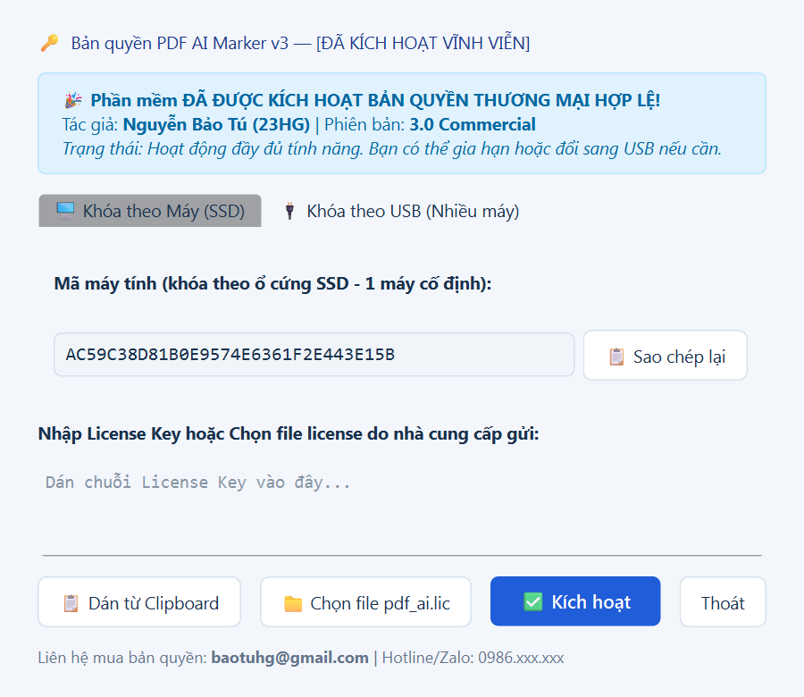

# PDF AI Marker v3 — Chuyển Hồ Sơ Xây Dựng (PDF / Word / Excel) Sang AI Chuẩn Cấu Trúc

  

  <b>Phần mềm chuyên dụng 100% Offline: Chuyển đổi bản vẽ scan, hồ sơ thiết kế, dự toán, tài liệu Word & Excel thành dữ liệu có cấu trúc sạch cho AI (LLM / RAG / ChatGPT / Claude).</b>

  
  
  
  
  

---

## 🌟 GIỚI THIỆU TỔNG QUAN

Trong ngành xây dựng (**AEC**), việc ứng dụng Trí tuệ Nhân tạo (AI, LLM, RAG) thường gặp rào cản lớn nhất ở khâu **dữ liệu đầu vào**:
- Bản vẽ scan, hồ sơ nghiệm thu, bản vẽ thi công bị nghiêng, mờ hoặc chữ quá nhỏ.
- Chữ tiếng Việt sử dụng font cũ thời kỳ trước: **TCVN3 (.VnTime)**, **VNI (VNI-Times)** hoặc font chữ AutoCAD kỹ thuật **SHX Text**.
- Bảng số liệu dự toán, cao độ, tọa độ, khối lượng bị vỡ khung khi chuyển sang text thông thường.
- Dữ liệu dự án nhạy cảm, tuyệt đối không được tải lên các dịch vụ đám mây công cộng.

**PDF AI Marker v3** được nghiên cứu và phát triển bởi **Nguyễn Bảo Tú (23HG)** để giải quyết triệt để các bài toán hóc búa trên. Toàn bộ phần mềm và mô hình AI chạy **100% cục bộ (Offline)** trên máy tính người dùng, mang lại độ chính xác vượt trội và bảo mật tuyệt đối cho mọi tài liệu công trình.

---

## 🚀 CÁC TÍNH NĂNG VƯỢT TRỘI DÀNH CHO KỸ SƯ XÂY DỰNG

### 1. OCR Tiếng Việt Có Dấu Đa Tầng (Multi-Engine AI)
- Tích hợp mô hình AI thị giác chuyên sâu, nhận diện tiếng Việt có dấu chuẩn xác ngay cả trên bản vẽ scan độ phân giải cao hoặc bản vẽ in lại nhiều lần.
- Tự động nhận diện và dịch mã font chữ chuyên dụng ngành xây dựng:
  - Font kỹ thuật AutoCAD: **AutoCAD SHX Text** (kể cả font nét vẽ vector SHX).
  - Font chữ cũ trong hồ sơ lưu trữ: **TCVN3 (.VnTime, .VnTimeH)** và **VNI (VNI-Times)** sang chuẩn Unicode dựng sẵn.
- **Kiểm tra chéo chữ số thông minh:** Tự động đối chiếu chéo số liệu giữa 2 bộ engine OCR độc lập. Các vị trí có sự sai lệch sẽ được đánh dấu cờ cảnh báo `⟦OCR khác: ...⟧` để kỹ sư rà soát dễ dàng, chống nhầm lẫn số liệu đo đạc / dự toán.

### 2. Dựng Ma Trận Bảng Biểu & Xuất Trực Tiếp Ra Excel (.xlsx)
- Tự động phát hiện hệ lưới đường kẻ ô (Table Grid Line Detection), phục hồi nguyên vẹn ma trận hàng - cột.
- Chuẩn hóa định dạng số: tự động nhận diện dấu phẩy/chấm thập phân kiểu Việt Nam và quốc tế.
- **Xuất đồng thời bảng tính Excel (`bang_so_lieu.xlsx`):** Tự động kẻ viền border, in đậm hàng tiêu đề, định dạng cột số chuẩn xác để kỹ sư mở Excel là tính toán và dùng hàm `SUM()` được ngay.
- Xuất dữ liệu đa tầng phục vụ lập trình và phân tích:
  - `noi_dung.md`: Bảng Markdown trực quan cho người đọc và AI.
  - `bang_so_lieu.xlsx`: Bảng tính Excel chuẩn mẫu phân tab từng trang và bảng tổng hợp.
  - `bang_so_lieu.json`: Toàn bộ bảng biểu trích xuất dưới dạng mảng JSON (headers, rows, numeric values).
  - `du_lieu.json`: Metadata chi tiết từng trang, tọa độ bounding box, độ tin cậy OCR.

### 3. Tự Động Bóc Tách Khung Tên & Lập Mục Lục Bản Vẽ
- Nhận diện vị trí khung tên kỹ thuật (Title Block) ở các góc bản vẽ.
- Tự động trích xuất các trường thông tin: *Số hiệu bản vẽ*, *Tên bản vẽ*, *Hạng mục*, *Tỷ lệ thiết kế*.
- Tự động biên soạn danh mục **"Mục lục bản vẽ"** có neo liên kết (anchor) ngay đầu file Markdown giúp tra cứu tức thì.

### 4. Đọc Trực Tiếp Tài Liệu Office (Word & Excel)
- Hỗ trợ trực tiếp các file `.docx`, `.xlsx`, `.xlsm` mà không cần xuất qua PDF hay qua bước OCR.
- Xử lý các ô gộp (merged cells) thông minh, giữ nguyên thứ bậc phân cấp cây thư mục (WBS) trong bảng tính dự toán và thuyết minh kỹ thuật.

### 5. Phân Đoạn Thông Minh (Smart Chunking) Sẵn Sàng Cho RAG AI
- Tự động cắt tài liệu thành các phân đoạn tối ưu (~3.000 ký tự) theo ranh giới đoạn văn và trang bản vẽ.
- Xuất file chuẩn `chia_doan.jsonl` kèm metadata nguồn gốc (*tên file, số trang, tên bản vẽ*), nạp trực tiếp vào các hệ thống Vector Database (Chroma, Qdrant, Milvus, Pinecone) hoặc các nền tảng AI Agent (LangChain, LlamaIndex, Dify).

### 6. Quét Thư Mục Hàng Loạt (Batch Folder Processing)
- Hỗ trợ bấm nút **`📁 Chọn Thư mục (Batch)`** hoặc kéo thả trực tiếp cả Folder dự án vào cửa sổ phần mềm.
- Tự động quét đệ quy tất cả các file PDF, Word (.docx) và Excel (.xlsx, .xlsm) trong các thư mục con để đưa vào hàng đợi xử lý liên tục.

### 7. Chế Độ Dùng Thử Tự Động (Auto-Trial 3 Ngày)
- Khách hàng mới tải về được kích hoạt ngay **3 ngày Dùng Thử Miễn Phí** với 100% tính năng mà không cần nhập key trước.
- Trải nghiệm trọn vẹn tốc độ và độ chính xác của AI trước khi quyết định đăng ký bản quyền vĩnh viễn.

### 8. Bảo Mật Tuyệt Đối — 100% Chạy Offline
- Không kết nối Internet, không gửi dữ liệu ra bên ngoài.
- Tận dụng sức mạnh phần cứng máy tính: tăng tốc bằng card đồ họa rời NVIDIA (CUDA) hoặc tối ưu hóa trên CPU đa nhân.

---

## 🔑 BẢN QUYỀN THƯƠNG MẠI & QUẢN LÝ GIẤY PHÉP

Hệ thống bảo vệ bản quyền sử dụng thuật toán mã hóa bất đối xứng **RSA-1024** chuẩn công nghiệp, cho phép khách hàng linh hoạt lựa chọn hình thức cấp phép phù hợp:

  

### Bảng Giá Giấy Phép Sử Dụng:

| Gói Bản Quyền | Đối Tượng Áp Dụng | Cơ Chế Cấp Phép | Đơn Giá |
| :--- | :--- | :--- | :--- |
| 💻 **Gói Máy Tính Cố Định (SSD)** | Kỹ sư làm việc chủ yếu trên máy bàn hoặc 1 laptop cá nhân | Khóa bản quyền gắn liền với Serial phần cứng ổ cứng SSD / Mainboard | **500.000 đ / 1 năm** *(1.000.000 đ trọn đời)* |
| 🔌 **Gói USB Dongle (Di Động)** | Kỹ sư thường xuyên di chuyển giữa máy công trường, laptop và máy văn phòng | Khóa bản quyền tích hợp theo USB (Sandisk/Kingston/...). Cắm USB vào máy nào là máy đó sử dụng được | **800.000 đ / 1 năm** *(2.000.000 đ trọn đời)* |

---

## ⚡ QUY TRÌNH MUA VÀ KÍCH HOẠT KEY (CHỈ 3 BƯỚC)

1. **Bước 1 — Lấy mã máy (Machine ID):**
   - Mở phần mềm `PDF_AI_Marker.exe`. Cửa sổ kích hoạt bản quyền sẽ tự động xuất hiện trong lần chạy đầu tiên (hoặc bấm nút **`🔑 Kiểm tra BẢN QUYỀN`** trên thanh công cụ).
   - Mã máy (Machine ID) **đã được tự động sao chép vào bộ nhớ tạm (Clipboard)**.
2. **Bước 2 — Gửi mã và thanh toán:**
   - Mở Zalo số **0986.xxx.xxx** hoặc gửi Email tới **baotuhg@gmail.com**, ấn `Ctrl + V` để gửi chuỗi Machine ID.
   - Thực hiện thanh toán theo thông tin tài khoản bên dưới.
3. **Bước 3 — Nhận Key và sử dụng:**
   - Trong vòng 3 - 5 phút, tác giả sẽ gửi lại chuỗi **License Key** (hoặc file `pdf_ai.lic`).
   - Bạn chỉ cần bấm **"Dán từ Clipboard"** (hoặc **"Chọn file pdf_ai.lic"**) rồi bấm **"Kích hoạt"** $\rightarrow$ Phần mềm chuyển sang trạng thái `[ĐÃ KÍCH HOẠT VĨNH VIỄN]`.

---

## 📥 TẢI BỘ CÀI ĐẶT TRỌN GÓI (OFFLINE STANDALONE PACKAGE)

Do phần mềm tích hợp sẵn toàn bộ mô hình AI, môi trường PyTorch và engine OCR offline (~8.6 GB sau khi giải nén), bộ cài đặt trọn gói được lưu trữ và chia sẻ qua liên kết tốc độ cao:

👉 **[BẤM VÀO ĐÂY ĐỂ TẢI BẢN TRỌN GÓI (Google Drive / OneDrive)](#)**  
*(Vui lòng liên hệ tác giả qua Zalo/Email để nhận liên kết tải chính thức mới nhất)*

### Hướng Dẫn Cài Đặt Siêu Tốc:
1. Tải file nén `.rar` về máy tính và giải nén ra ổ đĩa (khuyến nghị ổ `D:\` hoặc `C:\`, cần khoảng 9 GB trống).
2. Chạy trực tiếp file **`PDF_AI_Marker.exe`** (không cần cài Python, không cần cài đặt môi trường phức tạp).
3. Nếu máy tính Windows mới/máy sạch thông báo thiếu file DLL: Cài đặt gói [Microsoft Visual C++ 2015-2022 Redistributable (x64)](https://aka.ms/vs/17/release/vc_redist.x64.exe) từ trang chủ Microsoft.

---

## 💻 YÊU CẦU CẤU HÌNH HỆ THỐNG

| Thành phần | Cấu hình tối thiểu | Cấu hình khuyến nghị |
| :--- | :--- | :--- |
| **Hệ điều hành** | Windows 10 (64-bit) Version 1909 trở lên | Windows 10 / Windows 11 (64-bit) |
| **Bộ xử lý (CPU)** | Intel Core i5 / AMD Ryzen 5 (4 nhân 8 luồng) | Intel Core i7 / AMD Ryzen 7 trở lên |
| **Bộ nhớ RAM** | 8 GB RAM | 16 GB - 32 GB RAM |
| **Card đồ họa (GPU)** | Không bắt buộc (chạy chế độ OCR nhanh / bản gõ) | NVIDIA GeForce RTX 2060 / 3060 / 4060 trở lên (VRAM >= 6GB) |
| **Ổ cứng lưu trữ** | 10 GB dung lượng trống | Ổ cứng thể rắn SSD (NVMe / SATA III) |

---

## 💳 THÔNG TIN THANH TOÁN & ĐĂNG KÝ BẢN QUYỀN

- **Chủ tài khoản:** NGUYEN BAO TU
- **Ngân hàng:** [Tên Ngân Hàng] — Số tài khoản: `xxxx-xxxx-xxxx`
- **Ví điện tử MoMo:** `0986xxxxxx`
- **Cú pháp chuyển khoản:** `[Họ Tên] [Số Điện Thoại] - PDF AI Marker`

---

## 📞 THÔNG TIN TÁC GIẢ & HỖ TRỢ KỸ THUẬT

- **Tác giả:** **Nguyễn Bảo Tú (23HG)**
- **Email:** [baotuhg@gmail.com](mailto:baotuhg@gmail.com)
- **Hotline / Zalo:** `0986.xxx.xxx`
- **GitHub Repository:** [https://github.com/baotuhg/PDF_AI_Marker](https://github.com/baotuhg/PDF_AI_Marker)

---

  <i>Bản quyền (C) 2026 Nguyễn Bảo Tú (23HG). Toàn bộ quyền sở hữu trí tuệ được bảo lưu.</i>

